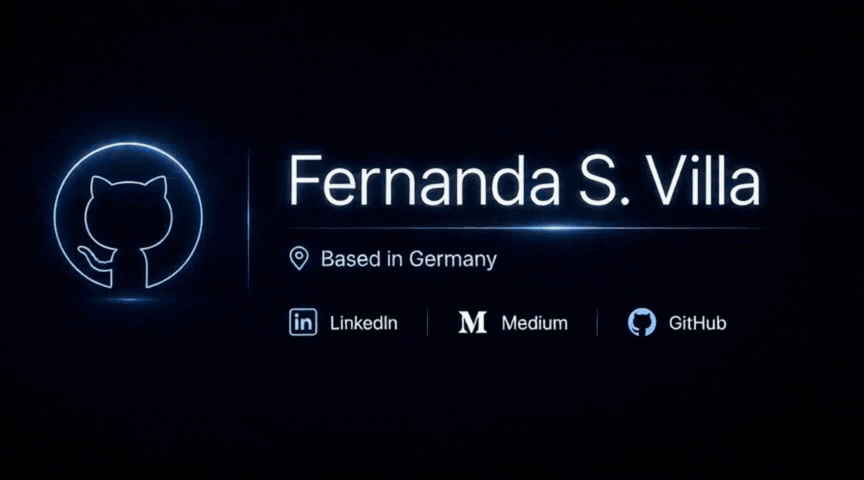

# Hey! I'm Fernanda S. Villa

**Interested in how intelligence is engineered, how data is governed, and how technology quietly reshapes the world around us.**

Based in Germany | Working on AI Governance & Data Governance

### Connect with me

---

## What I'm building with

---

## Projects

| Project | Project Here | Repository |
|---------|------|------|
| AI & Data Governance Maps | [Visit][1] | [GitHub][2] |
| The GDPR Constellation | [Visit][1] | [GitHub][2] |
| DataGovern-Policy-as-Code | Coming soon | [GitHub][3] |

[1]: https://fernandasvilla.github.io/AI-and-Data-Governance-map/
[2]: https://github.com/FernandaSVilla/AI-and-Data-Governance-map
[3]: https://github.com/FernandaSVilla/DataGovern-Policy-as-Code

---

## Currently exploring

---

## Latest writing

Reading and writing about AI governance, data strategy, and compliance on [Medium](https://medium.com/@FernandaSVilla). Coming soon.

---

## Let's connect

Interested in talking about:
- How AI governance frameworks are evolving
- Data governance automation and best practices
- Privacy-first architectures
- Open source tools for compliance and ethics
- The space where technology meets policy

Reach out on [LinkedIn](https://www.linkedin.com/in/mariafsanchezvilla/) or open an issue in any repo.

